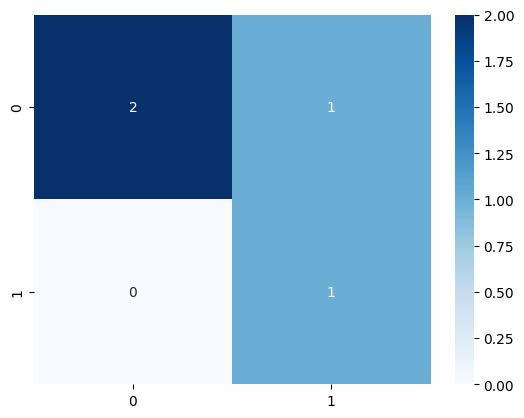

# Decision Trees - Jupyter Notebook

```python
# This Python 3 environment comes with many helpful analytics libraries installed
# It is defined by the kaggle/python Docker image: https://github.com/kaggle/docker-python
# For example, here's several helpful packages to load

import numpy as np # linear algebra
import pandas as pd # data processing, CSV file I/O (e.g. pd.read_csv)

# Input data files are available in the read-only "../input/" directory
# For example, running this (by clicking run or pressing Shift+Enter) will list all files under the input directory

import os
for dirname, _, filenames in os.walk('/kaggle/input'):
    for filename in filenames:
        print(os.path.join(dirname, filename))

# You can write up to 20GB to the current directory (/kaggle/working/) that gets preserved as output when you create a version using "Save & Run All" 
# You can also write temporary files to /kaggle/temp/, but they won't be saved outside of the current session
```

    /kaggle/input/salaries/salaries.csv
    


```python
import pandas as pd
import numpy as np
import matplotlib.pyplot as plt
```


```python
df = pd.read_csv("/kaggle/input/salaries/salaries.csv")

df.head()
```


<div>
<style scoped>
    .dataframe tbody tr th:only-of-type {
        vertical-align: middle;
    }

    .dataframe tbody tr th {
        vertical-align: top;
    }

    .dataframe thead th {
        text-align: right;
    }
</style>
<table border="1" class="dataframe">
  <thead>
    <tr style="text-align: right;">
      <th></th>
      <th>company</th>
      <th>job</th>
      <th>degree</th>
      <th>salary_more_then_100k</th>
    </tr>
  </thead>
  <tbody>
    <tr>
      <th>0</th>
      <td>google</td>
      <td>sales executive</td>
      <td>bachelors</td>
      <td>0</td>
    </tr>
    <tr>
      <th>1</th>
      <td>google</td>
      <td>sales executive</td>
      <td>masters</td>
      <td>0</td>
    </tr>
    <tr>
      <th>2</th>
      <td>google</td>
      <td>business manager</td>
      <td>bachelors</td>
      <td>1</td>
    </tr>
    <tr>
      <th>3</th>
      <td>google</td>
      <td>business manager</td>
      <td>masters</td>
      <td>1</td>
    </tr>
    <tr>
      <th>4</th>
      <td>google</td>
      <td>computer programmer</td>
      <td>bachelors</td>
      <td>0</td>
    </tr>
  </tbody>
</table>
</div>


```python
df.shape
```


    (16, 4)


```python
df.dtypes
```


    company                  object
    job                      object
    degree                   object
    salary_more_then_100k     int64
    dtype: object


## DATA PROCESSING


```python
X = df.drop(columns = ['salary_more_then_100k']) # this has categorical columns
y = df['salary_more_then_100k']

X.shape, y.shape
```


    ((16, 3), (16,))


```python
X.head()
```


<div>
<style scoped>
    .dataframe tbody tr th:only-of-type {
        vertical-align: middle;
    }

    .dataframe tbody tr th {
        vertical-align: top;
    }

    .dataframe thead th {
        text-align: right;
    }
</style>
<table border="1" class="dataframe">
  <thead>
    <tr style="text-align: right;">
      <th></th>
      <th>company</th>
      <th>job</th>
      <th>degree</th>
    </tr>
  </thead>
  <tbody>
    <tr>
      <th>0</th>
      <td>google</td>
      <td>sales executive</td>
      <td>bachelors</td>
    </tr>
    <tr>
      <th>1</th>
      <td>google</td>
      <td>sales executive</td>
      <td>masters</td>
    </tr>
    <tr>
      <th>2</th>
      <td>google</td>
      <td>business manager</td>
      <td>bachelors</td>
    </tr>
    <tr>
      <th>3</th>
      <td>google</td>
      <td>business manager</td>
      <td>masters</td>
    </tr>
    <tr>
      <th>4</th>
      <td>google</td>
      <td>computer programmer</td>
      <td>bachelors</td>
    </tr>
  </tbody>
</table>
</div>


```python
from sklearn.preprocessing import LabelEncoder

le = LabelEncoder()
X['le_company'] = le.fit_transform(X.company)
X.le_company.sample(6)
```


    9     0
    0     2
    14    1
    3     2
    13    1
    10    1
    Name: le_company, dtype: int64


```python
X['le_job'] = le.fit_transform(X.job)
X.le_job.sample(6)
```


    1     2
    4     1
    0     2
    13    0
    5     1
    7     1
    Name: le_job, dtype: int64


```python
X['le_degree'] = le.fit_transform(X.degree)
X.le_degree.sample(6)
```


    14    0
    12    0
    6     1
    2     0
    10    0
    3     1
    Name: le_degree, dtype: int64


```python
X.head()
```


<div>
<style scoped>
    .dataframe tbody tr th:only-of-type {
        vertical-align: middle;
    }

    .dataframe tbody tr th {
        vertical-align: top;
    }

    .dataframe thead th {
        text-align: right;
    }
</style>
<table border="1" class="dataframe">
  <thead>
    <tr style="text-align: right;">
      <th></th>
      <th>company</th>
      <th>job</th>
      <th>degree</th>
      <th>le_company</th>
      <th>le_job</th>
      <th>le_degree</th>
    </tr>
  </thead>
  <tbody>
    <tr>
      <th>0</th>
      <td>google</td>
      <td>sales executive</td>
      <td>bachelors</td>
      <td>2</td>
      <td>2</td>
      <td>0</td>
    </tr>
    <tr>
      <th>1</th>
      <td>google</td>
      <td>sales executive</td>
      <td>masters</td>
      <td>2</td>
      <td>2</td>
      <td>1</td>
    </tr>
    <tr>
      <th>2</th>
      <td>google</td>
      <td>business manager</td>
      <td>bachelors</td>
      <td>2</td>
      <td>0</td>
      <td>0</td>
    </tr>
    <tr>
      <th>3</th>
      <td>google</td>
      <td>business manager</td>
      <td>masters</td>
      <td>2</td>
      <td>0</td>
      <td>1</td>
    </tr>
    <tr>
      <th>4</th>
      <td>google</td>
      <td>computer programmer</td>
      <td>bachelors</td>
      <td>2</td>
      <td>1</td>
      <td>0</td>
    </tr>
  </tbody>
</table>
</div>


```python
X = X.drop(columns = ['company','job','degree'])

```


```python
X.head() # Completely encoded columns
```


<div>
<style scoped>
    .dataframe tbody tr th:only-of-type {
        vertical-align: middle;
    }

    .dataframe tbody tr th {
        vertical-align: top;
    }

    .dataframe thead th {
        text-align: right;
    }
</style>
<table border="1" class="dataframe">
  <thead>
    <tr style="text-align: right;">
      <th></th>
      <th>le_company</th>
      <th>le_job</th>
      <th>le_degree</th>
    </tr>
  </thead>
  <tbody>
    <tr>
      <th>0</th>
      <td>2</td>
      <td>2</td>
      <td>0</td>
    </tr>
    <tr>
      <th>1</th>
      <td>2</td>
      <td>2</td>
      <td>1</td>
    </tr>
    <tr>
      <th>2</th>
      <td>2</td>
      <td>0</td>
      <td>0</td>
    </tr>
    <tr>
      <th>3</th>
      <td>2</td>
      <td>0</td>
      <td>1</td>
    </tr>
    <tr>
      <th>4</th>
      <td>2</td>
      <td>1</td>
      <td>0</td>
    </tr>
  </tbody>
</table>
</div>


```python
X.dtypes
```


    le_company    int64
    le_job        int64
    le_degree     int64
    dtype: object


```python
from sklearn.model_selection import train_test_split

X_train, X_test, y_train, y_test = train_test_split(X, y, test_size = 0.2, random_state = 42)
```


```python
from sklearn.tree import DecisionTreeClassifier

model = DecisionTreeClassifier()
model.fit(X_train, y_train)
```


<style>#sk-container-id-2 {color: black;background-color: white;}#sk-container-id-2 pre{padding: 0;}#sk-container-id-2 div.sk-toggleable {background-color: white;}#sk-container-id-2 label.sk-toggleable__label {cursor: pointer;display: block;width: 100%;margin-bottom: 0;padding: 0.3em;box-sizing: border-box;text-align: center;}#sk-container-id-2 label.sk-toggleable__label-arrow:before {content: "▸";float: left;margin-right: 0.25em;color: #696969;}#sk-container-id-2 label.sk-toggleable__label-arrow:hover:before {color: black;}#sk-container-id-2 div.sk-estimator:hover label.sk-toggleable__label-arrow:before {color: black;}#sk-container-id-2 div.sk-toggleable__content {max-height: 0;max-width: 0;overflow: hidden;text-align: left;background-color: #f0f8ff;}#sk-container-id-2 div.sk-toggleable__content pre {margin: 0.2em;color: black;border-radius: 0.25em;background-color: #f0f8ff;}#sk-container-id-2 input.sk-toggleable__control:checked~div.sk-toggleable__content {max-height: 200px;max-width: 100%;overflow: auto;}#sk-container-id-2 input.sk-toggleable__control:checked~label.sk-toggleable__label-arrow:before {content: "▾";}#sk-container-id-2 div.sk-estimator input.sk-toggleable__control:checked~label.sk-toggleable__label {background-color: #d4ebff;}#sk-container-id-2 div.sk-label input.sk-toggleable__control:checked~label.sk-toggleable__label {background-color: #d4ebff;}#sk-container-id-2 input.sk-hidden--visually {border: 0;clip: rect(1px 1px 1px 1px);clip: rect(1px, 1px, 1px, 1px);height: 1px;margin: -1px;overflow: hidden;padding: 0;position: absolute;width: 1px;}#sk-container-id-2 div.sk-estimator {font-family: monospace;background-color: #f0f8ff;border: 1px dotted black;border-radius: 0.25em;box-sizing: border-box;margin-bottom: 0.5em;}#sk-container-id-2 div.sk-estimator:hover {background-color: #d4ebff;}#sk-container-id-2 div.sk-parallel-item::after {content: "";width: 100%;border-bottom: 1px solid gray;flex-grow: 1;}#sk-container-id-2 div.sk-label:hover label.sk-toggleable__label {background-color: #d4ebff;}#sk-container-id-2 div.sk-serial::before {content: "";position: absolute;border-left: 1px solid gray;box-sizing: border-box;top: 0;bottom: 0;left: 50%;z-index: 0;}#sk-container-id-2 div.sk-serial {display: flex;flex-direction: column;align-items: center;background-color: white;padding-right: 0.2em;padding-left: 0.2em;position: relative;}#sk-container-id-2 div.sk-item {position: relative;z-index: 1;}#sk-container-id-2 div.sk-parallel {display: flex;align-items: stretch;justify-content: center;background-color: white;position: relative;}#sk-container-id-2 div.sk-item::before, #sk-container-id-2 div.sk-parallel-item::before {content: "";position: absolute;border-left: 1px solid gray;box-sizing: border-box;top: 0;bottom: 0;left: 50%;z-index: -1;}#sk-container-id-2 div.sk-parallel-item {display: flex;flex-direction: column;z-index: 1;position: relative;background-color: white;}#sk-container-id-2 div.sk-parallel-item:first-child::after {align-self: flex-end;width: 50%;}#sk-container-id-2 div.sk-parallel-item:last-child::after {align-self: flex-start;width: 50%;}#sk-container-id-2 div.sk-parallel-item:only-child::after {width: 0;}#sk-container-id-2 div.sk-dashed-wrapped {border: 1px dashed gray;margin: 0 0.4em 0.5em 0.4em;box-sizing: border-box;padding-bottom: 0.4em;background-color: white;}#sk-container-id-2 div.sk-label label {font-family: monospace;font-weight: bold;display: inline-block;line-height: 1.2em;}#sk-container-id-2 div.sk-label-container {text-align: center;}#sk-container-id-2 div.sk-container {/* jupyter's `normalize.less` sets `[hidden] { display: none; }` but bootstrap.min.css set `[hidden] { display: none !important; }` so we also need the `!important` here to be able to override the default hidden behavior on the sphinx rendered scikit-learn.org. See: https://github.com/scikit-learn/scikit-learn/issues/21755 */display: inline-block !important;position: relative;}#sk-container-id-2 div.sk-text-repr-fallback {display: none;}</style><div id="sk-container-id-2" class="sk-top-container"><div class="sk-text-repr-fallback"><pre>DecisionTreeClassifier()</pre><b>In a Jupyter environment, please rerun this cell to show the HTML representation or trust the notebook. <br />On GitHub, the HTML representation is unable to render, please try loading this page with nbviewer.org.</b></div><div class="sk-container" hidden><div class="sk-item"><div class="sk-estimator sk-toggleable"><input class="sk-toggleable__control sk-hidden--visually" id="sk-estimator-id-2" type="checkbox" checked><label for="sk-estimator-id-2" class="sk-toggleable__label sk-toggleable__label-arrow">DecisionTreeClassifier</label><div class="sk-toggleable__content"><pre>DecisionTreeClassifier()</pre></div></div></div></div></div>


```python
model.score(X_test, y_test)
```


    0.75


```python
y_pred = model.predict(X_test)
```


```python
from sklearn.metrics import confusion_matrix
import seaborn as sns

cm = confusion_matrix(y_pred, y_test)
sns.heatmap(cm, cmap = 'Blues', annot = True)
```


    <Axes: >


    

    

